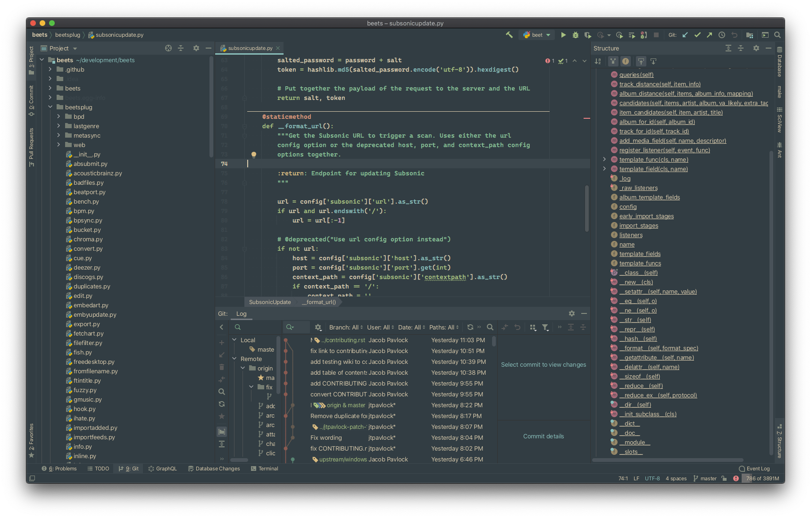

# Forest Night - JetBrains Theme 

 

## Install

Open **Settings ➜ Plugins**, switch to the **Marketplace** tab and search for `Forest Night`.

> :point_right: See [docs](docs/) for more information.
